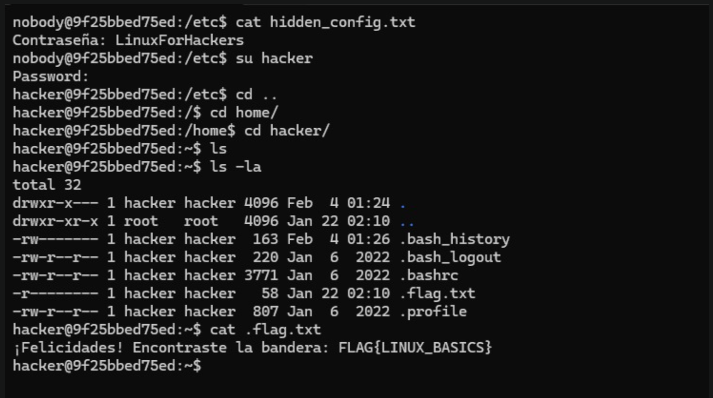

# Challenge 1

## Desarrollo del reto

### Exploracion inicial

Se inicia sesion como nobody, un usuario con permisos limitados. A partir de ahi se realiza una exploracion del sistema, enfocandose en el directorio /etc, el cual suele contener archivos de configuracion importantes.

Dentro de este directorio se encontro el archivo:

hidden_config.txt

Al mostrar su contenido, se obtuvo la siguiente informacion:

Contrasena: LinuxForHackers

Esta contrasena permitio escalar privilegios y cambiar al usuario hacker.

---

### Cambio de usuario

Utilizando la contrasena encontrada, se ejecuto el comando:

su hacker

El acceso fue exitoso, permitiendo ingresar al entorno del usuario hacker.

---

### Busqueda de la bandera

Una vez dentro del directorio personal del usuario hacker (/home/hacker), se listaron los archivos ocultos usando:

ls -la

Entre los archivos se identifico uno llamado:

.flag.txt

Este archivo contenia la bandera final del desafio.

---

## Resultado

El contenido del archivo .flag.txt fue el siguiente:

Felicitaciones! Encontraste la bandera: FLAG{LINUX_BASICS}

---

## Analisis

Este challenge permitio comprender la importancia de explorar archivos de configuracion del sistema, ya que muchas veces contienen informacion sensible como contrasenas o pistas. Tambien refuerza el uso correcto de comandos basicos de Linux y el manejo de permisos y usuarios.

---

## Conclusiones

El Challenge 1 sienta las bases para los retos posteriores, ya que introduce la logica de reutilizar informacion obtenida en un desafio como credencial para los siguientes. Este enfoque refuerza el pensamiento estrategico y la atencion al detalle, habilidades clave en escenarios de CTF.

---

## Imagen de resultado

---

## Flag obtenida

FLAG{LINUX_BASICS}
