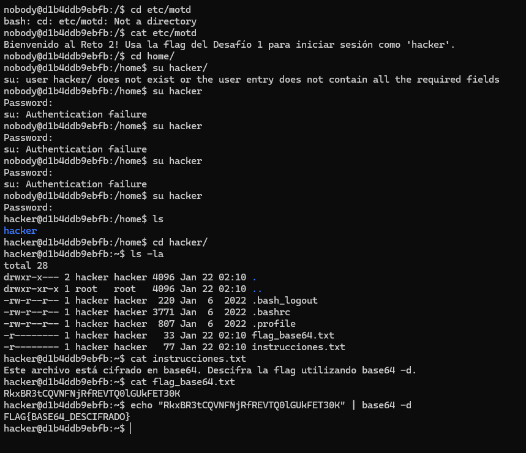
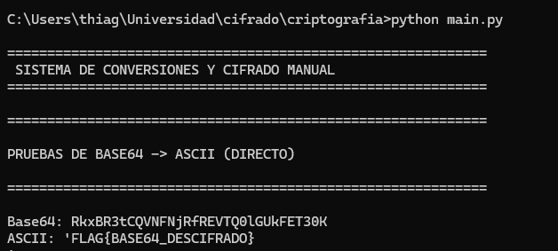

# Challenge 2 - Codificacion Base64

## Desarrollo del reto

### Acceso inicial

Inicie sesion como el usuario nobody. Al revisar el archivo /etc/motd se indicaba claramente que para este reto debia utilizar la flag obtenida en el Challenge 1 como contrasena para iniciar sesion como el usuario hacker.

Utilice la flag del Challenge 1 como contrasena y logre cambiar correctamente de usuario.

---

### Exploracion del directorio hacker

Una vez dentro del directorio /home/hacker, liste los archivos disponibles y encontre dos archivos importantes:

flag_base64.txt  
instrucciones.txt  

Al leer el archivo instrucciones.txt se indicaba que el contenido del archivo flag_base64.txt estaba cifrado en base64 y debia ser descifrado utilizando el comando base64 -d.

---

### Decodificacion Base64

El contenido del archivo flag_base64.txt era el siguiente:

RkxBR3tCQVNFNjRfREVTQ0lGUkFET30K

Para descifrarlo ejecute el comando:

echo "RkxBR3tCQVNFNjRfREVTQ0lGUkFET30K" | base64 -d

El resultado fue una cadena legible que correspondia a la bandera del desafio.

---

## Resultado

El texto decodificado fue:

FLAG{BASE64_DESCIFRADO}

---

## Analisis

Este challenge permitio comprender el funcionamiento de la codificacion Base64 y su uso comun para ocultar informacion de manera sencilla. Tambien reforzo el uso de comandos basicos de Linux y la importancia de leer cuidadosamente las instrucciones proporcionadas dentro del sistema.

Ademas, se mantuvo la continuidad entre desafios, ya que la flag del Challenge 1 fue necesaria para acceder al usuario hacker en este reto.

---

## Conclusiones

El Challenge 2 demuestra que muchas tecnicas de ocultamiento no requieren cifrados complejos y pueden ser resueltas con herramientas basicas del sistema. El uso encadenado de flags entre retos obliga a llevar un registro ordenado de la informacion obtenida y fomenta una metodologia estructurada para resolver CTFs.

---

## Imagen de resultado

---

## Flag obtenida

FLAG{BASE64_DESCIFRADO}
