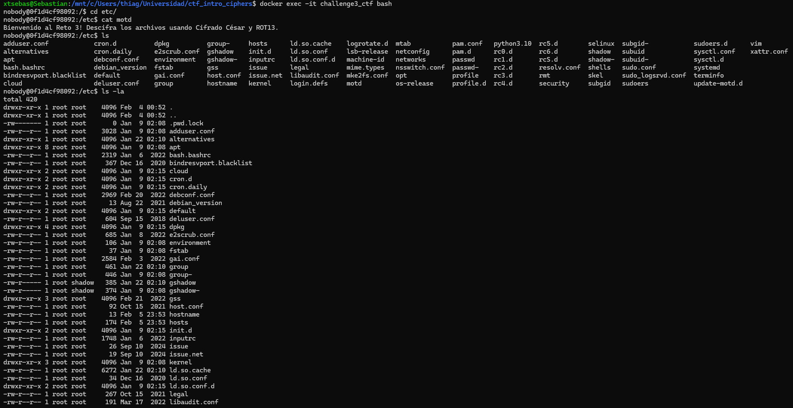
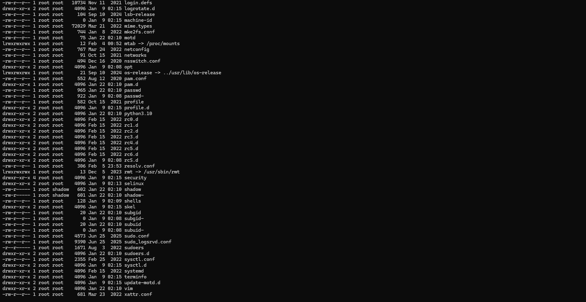
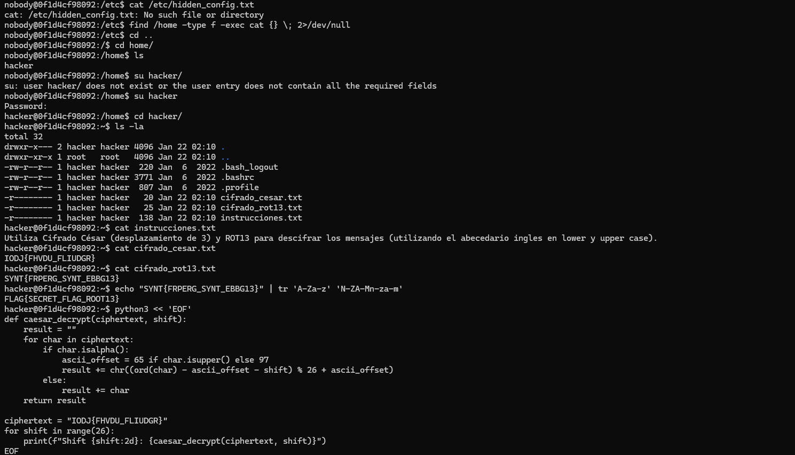
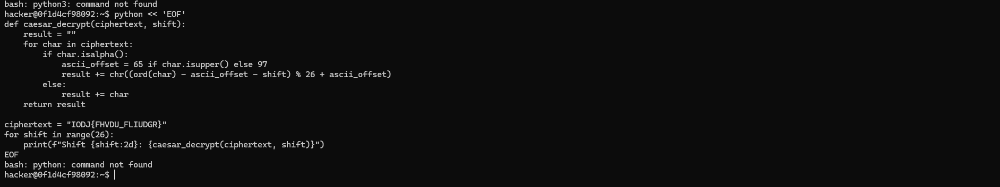
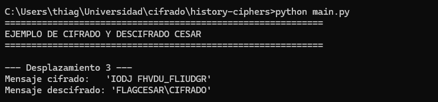

# Challenge 3 - Cifrado Cesar y ROT13

## Desarrollo del reto

### Acceso inicial

Inicie sesion en el contenedor del Challenge 3 como el usuario nobody. Al revisar el archivo /etc/motd se indicaba que debia descifrar archivos utilizando Cifrado Cesar y ROT13.

Tal como en los desafios anteriores, utilice la flag obtenida previamente como contrasena para iniciar sesion como el usuario hacker.

---

### Exploracion del directorio hacker

Una vez dentro del directorio /home/hacker, liste los archivos disponibles y encontre los siguientes archivos relevantes:

cifrado_cesar.txt  
cifrado_rot13.txt  
instrucciones.txt  

Al leer el archivo instrucciones.txt se indicaba que debia usar Cifrado Cesar con desplazamiento de 3 y ROT13, utilizando el abecedario ingles en mayusculas y minusculas.

---

### Descifrado ROT13

El contenido del archivo cifrado_rot13.txt era:

SYNT{FRPERG_SYNT_EBBG13}

Para descifrarlo utilice el comando:

echo "SYNT{FRPERG_SYNT_EBBG13}" | tr 'A-Za-z' 'N-ZA-Mn-za-m'

El resultado fue:

FLAG{SECRET_FLAG_ROOT13}

---

### Descifrado Cesar (desplazamiento 3)

El contenido del archivo cifrado_cesar.txt era:

IODJ{FHVDU_FLUDGR}

Este mensaje corresponde a un cifrado Cesar con desplazamiento 3. Al descifrarlo se obtuvo:

FLAG{CESAR_CIFRADO}

---

## Resultado

Las banderas obtenidas en este desafio fueron:

FLAG{CESAR_CIFRADO}  
FLAG{SECRET_FLAG_ROOT13}

---

## Analisis

Este challenge permitio comprender el funcionamiento del cifrado Cesar y del cifrado ROT13, ambos basados en desplazamientos dentro del alfabeto. Se evidencio que ROT13 es un caso especial de Cesar con desplazamiento fijo, y que puede resolverse facilmente con herramientas basicas de Linux como tr.

Ademas, se reforzo la metodologia de reutilizar flags de desafios anteriores como credenciales, manteniendo una continuidad logica entre los retos.

---

## Conclusiones

El Challenge 3 demuestra que los cifrados clasicos, aunque simples, siguen siendo utiles para comprender conceptos fundamentales de criptografia. El uso de herramientas nativas del sistema facilita el analisis y descifrado sin necesidad de software adicional. Este reto prepara el camino para desafios mas avanzados como el analisis de frecuencia.

---

## Imagen de resultado

---

## Flags obtenidas

FLAG{CESAR_CIFRADO}  
FLAG{SECRET_FLAG_ROOT13}
