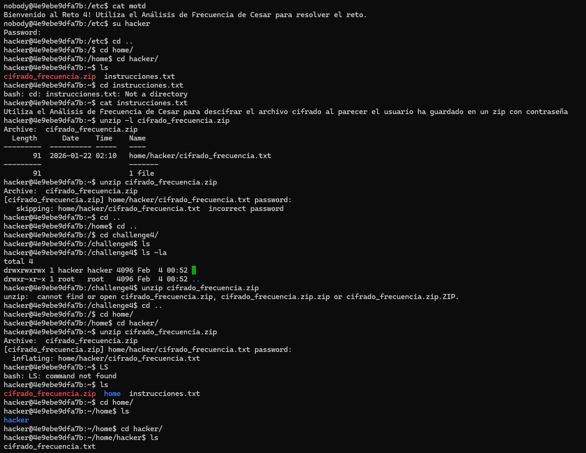
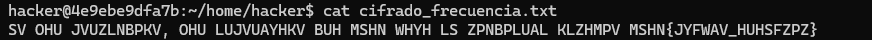
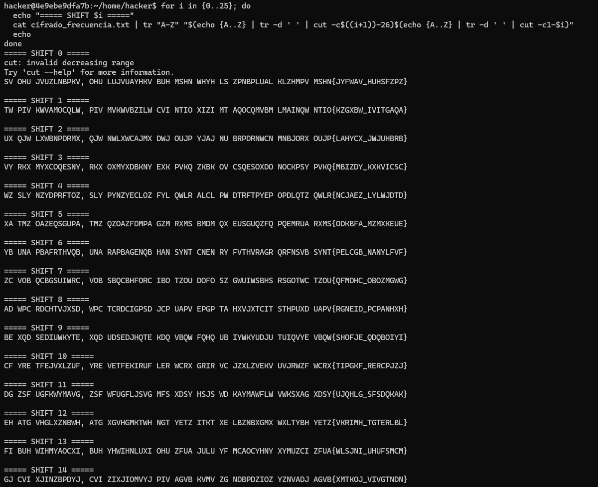
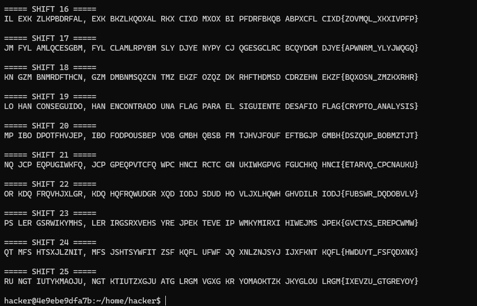
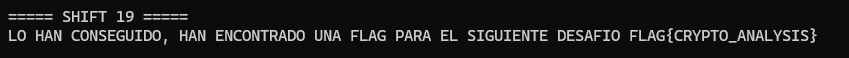

# Challenge 4 - Analisis de Frecuencia

## Desarrollo del reto

### Acceso inicial

Inicie sesion en el contenedor del Challenge 4 como el usuario nobody. Al revisar el archivo /etc/motd se indicaba que debia utilizar el Analisis de Frecuencia de Cesar para resolver el reto.

Tal como en los desafios anteriores, utilice la flag obtenida previamente en el Challenge 3 para iniciar sesion como el usuario hacker.

---

### Exploracion del directorio hacker

Una vez dentro del directorio /home/hacker, liste los archivos disponibles y encontre los siguientes archivos relevantes:

cifrado_frecuencia.zip  
instrucciones.txt  

Al leer el archivo instrucciones.txt se indicaba que el mensaje cifrado se encontraba dentro de un archivo zip protegido con contrasena.

---

### Acceso al archivo zip

Primero liste el contenido del zip utilizando:

unzip -l cifrado_frecuencia.zip

El archivo contenia:

home/hacker/cifrado_frecuencia.txt

Al intentar extraer el archivo, el sistema solicito una contrasena. Para este desafio, la primera contrasena utilizada para acceder al usuario hacker fue la flag obtenida del cifrado Cesar, y la contrasena del archivo zip correspondia a la flag obtenida del ROT13 en el Challenge 3.

Una vez utilizada la contrasena correcta, el archivo fue extraido exitosamente.

---

### Analisis de frecuencia y descifrado

El contenido del archivo cifrado_frecuencia.txt era:

SV OHU JVUZLNBPKV, OHU LUJVUAYHKV BUH MSHN WHYH LS ZPNBPLUAL KLZHMPV MSHN{JYFWAV_HUHSFZPZ}

Para resolverlo, aplique un enfoque de fuerza controlada probando todos los desplazamientos posibles del cifrado Cesar utilizando comandos bash. Al revisar las salidas, identifique el desplazamiento que producia un mensaje coherente en espanol.

El desplazamiento correcto fue 19, lo que produjo el mensaje descifrado:

LO HAN CONSEGUIDO, HAN ENCONTRADO UNA FLAG PARA EL SIGUIENTE DESAFIO FLAG{CRYPTO_ANALYSIS}

---

## Resultado

La bandera obtenida en este desafio fue:

FLAG{CRYPTO_ANALYSIS}

---

## Analisis

Este challenge permitio aplicar el analisis de frecuencia como herramienta practica para romper cifrados de sustitucion simples. Probar todos los desplazamientos de Cesar y evaluar la coherencia del texto resultante demostro ser un metodo efectivo incluso sin herramientas avanzadas.

Ademas, el reto reforzo la importancia de comprender patrones del lenguaje natural para identificar mensajes validos dentro de un conjunto de posibles soluciones.

---

## Conclusiones

El Challenge 4 consolida los conocimientos adquiridos en los retos anteriores, integrando exploracion del sistema, manejo de archivos comprimidos, reutilizacion de flags y analisis criptografico. Este enfoque progresivo fortalece el pensamiento analitico y prepara para desafios de mayor complejidad en criptografia y seguridad.

---

## Imagen de resultado

---

## Flag obtenida

FLAG{CRYPTO_ANALYSIS}
