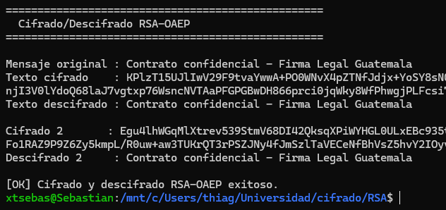

# Laboratorio 4

## Sebastian Huertas 22295

### 1. El sistema usa RSA como mecanismo de intercambio de clave, protegiendo una clave AES que cifra el documento real.
a. ¿Explique por qué no cifrar el documento directamente con RSA?

RSA solo puede cifrar datos de tamaño menor al de la clave (ej. 245 bytes con una clave de 2048 bits). Los documentos legales superan ese limite. Además, RSA es ordenes de magnitud mas lento que AES. Por eso es mejor usar cifrado hibrido: AES cifra el documento y RSA cifra unicamente la clave AES

### 2. Generación de Claves

b. ¿Qué información contiene un archivo .pem?

Un archivo PEM tiene tres partes visibles:

1. Encabezado y pie: `-----BEGIN PUBLIC KEY-----` / `-----END PUBLIC KEY-----`. Indican el tipo de objeto criptográfico almacenado.

2. Cuerpo en Base64: El bloque de caracteres entre los delimitadores es la codificación Base64 del objeto en formato DER (binario ASN.1). En este caso contiene:
   - El módulo n (2048 bits): el número producto de los dos primos secretos, base del cifrado RSA.
   - El exponente público e (normalmente 65537): usado para cifrar y verificar firmas.

Ejemplo del archivo generado (`public_key.pem`):
```
-----BEGIN PUBLIC KEY-----
MIIBIjANBgkqhkiG9w0BAQEFAAOCAQ8AMIIBCgKCAQEAoWsWW/ckkiY7e3xW2HnE
...
fQIDAQAB
-----END PUBLIC KEY-----
```
IDAQAB al final es la representación Base64 de 0x010001 = 65537, el exponente público estándar.

### 3. Cifrado y Descifrado Directo con RSA-OAEP

¿Porqué cifrar el mismo mensaje dos veces produce resultados distintos? Demuéstrenlo y expliquen que propiedad de OAEP lo cause

Demostración: mismo mensaje, misma clave publica, dos cifrados distintos:



*(Ambos se descifran correctamente al texto original.)*

Propiedad que lo causa: semilla aleatoria en el padding

OAEP no cifra el mensaje directamente. Antes de aplicar RSA realiza este proceso:

```
seed (aleatorio, 32 bytes) ──┐
                              ├─► MGF1(seed) XOR mensaje  → bloque_datos
mensaje ──────────────────────┘
                              └─► MGF1(bloque_datos) XOR seed → bloque_seed

RSA cifra: [bloque_seed | bloque_datos]
```

Cada llamada genera un seed distinto con SecureRandom, por lo que el bloque de entrada a RSA cambia completamente aunque el mensaje sea identico. Esto se denomina cifrado probabilistico: la misma entrada no produce la misma salida, lo que impide ataques de texto cifrado elegido y evita que un atacante distinga si dos mensajes cifrados son iguales.