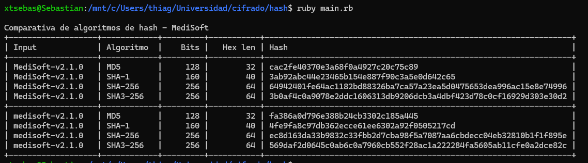
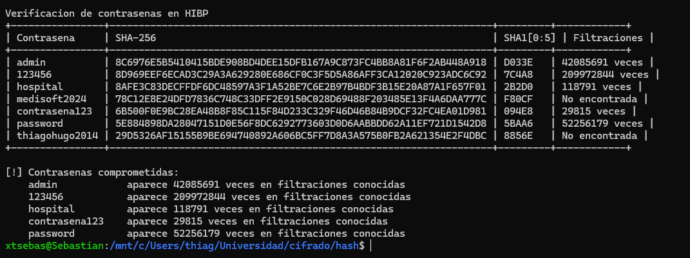
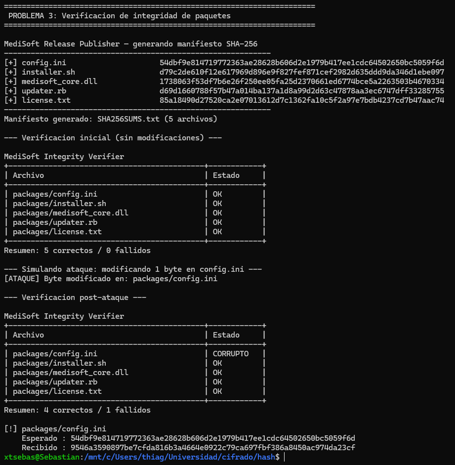
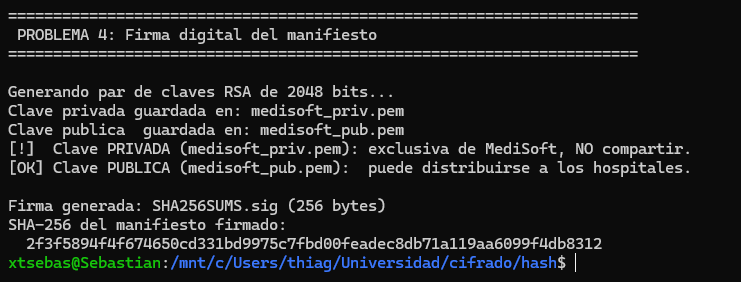
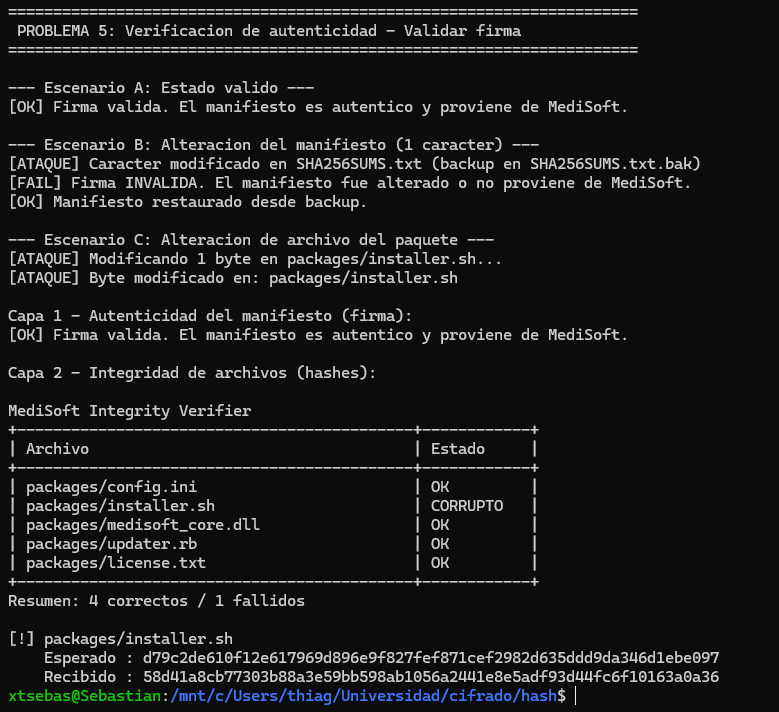

# Laboratorio Hashes

## Sebastian huertas 22295

### Problema 1



#### ¿Cuántos bits cambiaron entre los dos hashes SHA-256?

Comparando los hashes SHA-256 de "MediSoft-v2.1.0" y "medisoft-v2.1.0":

```
MediSoft: 64942401fe64ac1182bd88326ba7ca57a23ea5d0475653dea996ac15e8e74996
medisoft: ec8d163da33b9832c33fbb2d7cba98f5a7087aa6cbdecc04eb32810b1f1f895e
XOR:      88191932f95f34231e822060f3e752a5052ddff680884fda428a2d1ef7f8c8c8
```

Aplicando XOR: 120 de 256 bits cambiaron (46.9%)

La diferencia entre los dos inputs es mínima: solo cambió la capitalización de la primera letra (M → m), lo que a nivel binario equivale a 1 solo bit diferente (M = 0100 1101, m = 0110 1101).

Aun así, casi la mitad del hash cambió por completo. Esto demuestra el efecto avalancha. Para MediSoft, esto es crítico: cualquier alteración en un paquete de actualización, por pequeña que sea, producirá un hash completamente diferente al publicado.

---

#### ¿Por qué MD5 es inseguro para integridad de archivos?

MD5 produce un hash de solo 128 bits (32 caracteres hex). Esto lo hace vulnerable por dos razones:

1. Espacio de salida reducido: Con 2¹²⁸ posibles valores, la probabilidad de colisión (dos inputs diferentes con el mismo hash) es matemáticamente mayor que en SHA-256 (2²⁵⁶). Un atacante que controle el mirror, podría construir un paquete malicioso que produzca el mismo MD5 que el paquete legítimo

2. Colisiones demostradas: Desde 2004 se conocen ataques prácticos de colisión contra MD5. En 2008, investigadores crearon un certificado CA fraudulento usando colisiones MD5. Herramientas públicas como fastcoll generan colisiones en segundos en hardware convencional

Si MediSoft usara MD5 para verificar sus paquetes, un atacante podría entregar un instalador con código malicioso que tenga exactamente el mismo hash MD5 que el original, pasando la verificación sin problema

### Problema 2



### Problema 3



### Problema 4



### Problema 5



#### ¿Por que la firma es valida?

La firma digital se calculó sobre el contenido de SHA256SUMS.txt, no sobre los archivos del paquete directamente. Al modificar installer.sh, el archivo SHA256SUMS.txt no cambió en absoluto, por lo que la firma sigue siendo matemáticamente correcta: la clave pública confirma que ese manifiesto fue producido por MediSoft

#### ¿Qué sucede al ejecutar package_verify?

package_verify recalcula el SHA-256 de cada archivo listado en SHA256SUMS.txt y lo compara contra el hash que MediSoft publicó. Como installer.sh fue modificado, su hash actual es distinto al del manifiesto y aparece como CORRUPTO. El resto de archivos no fueron tocados y aparecen OK
