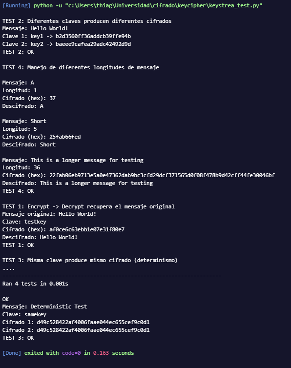

### Sebastian Huertas 22295

# Ejercicio STEAM

## Parte 2: Análisis de Seguridad (20 puntos)

### 2.1 Variación de la Clave (5 puntos)
- ¿Qué sucede cuando cambia la clave utilizada para generar el keystream? Demuestre con un ejemplo concreto.

Cuando se cambia la llave para desencriptar, genera un keystream diferente al que se uso para encriptar, porque el generador depende directamente de la seed. Como el cifrado funciona aplicando XOR, solo se puede revertir correctamente si se uso exactamente la misma secuencia de numeros. Al usarse otra llave, el XOR no recupero el texto original sino bytes aleatorios. Esos bytes no corresponden a caracteres validos, por eso aparece el error de codificacion al intentar imprimirlos

### 2.2 Reutilización del Keystream (5 puntos)
- ¿Qué riesgos de seguridad existen si reutiliza el mismo keystream para cifrar dos mensajes diferentes? Implemente un ejemplo que demuestre esta vulnerabilidad.
- Sugerencia: Cifre dos mensajes con la misma clave y analice qué información puede extraer un atacante que intercepte ambos textos cifrados.

Cuando se reutilizo el mismo keystream para cifrar dos mensajes distintos, se esta creando una vulnerabilidad grave porque en un cifrado tipo stream con XOR, si un atacante obtiene ambos textos cifrados puede hacer XOR entre ellos y eliminar el keystream, quedandose con el XOR de los dos mensajes originales, lo que permite recuperar informacion si conoce o adivina parte de uno de los mensajes. Por ejemplo, si hago C1 = M1 XOR K y C2 = M2 XOR K, entonces C1 XOR C2 = M1 XOR M2, y si el atacante sabe que M1 es "Hello World!", puede hacer (C1 XOR C2) XOR M1 y recuperar M2, demostrando que reutilizar la misma clave compromete completamente la confidencialidad

### 2.3 Longitud del Keystream (5 puntos)
-¿Cómo afecta la longitud del keystream a la seguridad del cifrado? Considere tanto keystreams más cortos como más largos que el mensaje.

La longitud del keystream afecta directamente la seguridad porque si es mas corto que el mensaje y se reutiliza o se repite, empiezan a aparecer patrones que pueden ser explotados por un atacante mediante analisis de XOR entre bloques repetidos. Si el keystream tiene la misma longitud que el mensaje y es verdaderamente aleatorio y no se reutiliza, el cifrado es mucho mas seguro, similar a un one time pad. Si es mas largo no hay problema mientras solo se use la parte necesaria y no se reutilice, pero lo critico no es que sea largo sino que no se repita ni se use la misma secuencia para distintos mensajes

### 2.4 Consideraciones Prácticas (5 puntos)
- ¿Qué consideraciones debe tener al generar un keystream en un entorno de producción real? Mencione al menos 3 aspectos críticos

    * Usar un generador criptograficamente seguro para que el keystream no sea predecible
    * No reutilizar el mismo keystream en diferentes mensajes
    * Proteger y generar las claves con suficiente entropia para evitar filtraciones o ataques de fuerza bruta

## Parte 3: Validación y Pruebas (10 puntos)

### 3.1 Ejemplos de Entrada/Salida
Incluya en su documentación al menos 3 ejemplos que muestren:
- Texto plano original
- Texto cifrado (puede mostrarse en formato hexadecimal o base64)
- Texto descifrado
- Clave utilizada

### 3.2 Pruebas Unitarias
Implemente pruebas que validen:
- El descifrado recupera exactamente el mensaje original
- Diferentes claves producen diferentes textos cifrados
- La misma clave produce el mismo texto cifrado (determinismo)
- El cifrado maneja correctamente mensajes de diferentes longitudes

## Parte 4: Reflexión Técnica (Opcional - 10 puntos extra)

### 4.1 Limitaciones de PRNG Simples
Reflexione sobre las limitaciones de los generadores pseudoaleatorios simples en aplicaciones criptográficas reales

Creo que cuando hay tanta simpleza, como si se sabe que largo tiene porque las keystream son de largo igual, o si la keystream es la misma, estas se pueden averiguar a pura fuerza, y en aplicaciones reales no dejaria hacerlo mucho mas seguro, o que los mensajes que se desean encriptar no deben ser largos y ni simples, sino precisos, creo que en eso se vuelve simple y menos efectivo. Ademas, la predictibilidad es un problema serio: si el PRNG es facil de modelar, un atacante puede estimar el siguiente bloque del keystream a partir de salidas previas. La periodicidad tambien afecta, porque muchos PRNG simples repiten su secuencia despues de un ciclo corto; si se detecta el periodo, se puede reconstruir el patron completo. Por ultimo, la calidad estadistica del keystream importa: si no pasa pruebas basicas de aleatoriedad (sesgo en bits, patrones repetidos o distribucion desigual), entonces el XOR deja huellas que facilitan ataques de analisis y reducen la confidencialidad.

### 4.2 Comparación con Stream Ciphers Modernos
Investigue cómo algoritmos modernos como ChaCha20 o AES-CTR generan keystreams y compare con
su implementación.

1. ¿Qué mejoras de seguridad ofrecen?
ChaCha20 y AES-CTR representan una mejora significativa frente a cifradores legados como RC4 o modos como CBC porque eliminan debilidades estructurales conocidas, como sesgos en el keystream o ataques de oráculo de relleno. Ambos permiten operación en modo flujo sin necesidad de padding, reduciendo vectores de ataque. Además, normalmente se implementan dentro de esquemas AEAD (ChaCha20-Poly1305 y AES-GCM), lo que añade autenticación e integridad al cifrado, evitando ataques de modificación o maleabilidad. ChaCha20 destaca por su resistencia a ataques de canal lateral en software, ya que no utiliza tablas de búsqueda dependientes de memoria, mientras que AES-CTR alcanza alta seguridad y rendimiento cuando se ejecuta con aceleración por hardware como AES-NI.

2. ¿Qué técnicas usan para evitar las vulnerabilidades de PRNG básicos?
A diferencia de PRNG estadísticos tradicionales (como Mersenne Twister), que tienen estructuras lineales y estados predecibles, ChaCha20 y AES-CTR funcionan como generadores criptográficamente seguros (CSPRNG) porque utilizan transformaciones no lineales complejas y alta difusión interna. AES emplea sustituciones no lineales (S-box) y múltiples rondas de mezcla; ChaCha20 usa operaciones ARX (adición módulo 2^32, rotaciones y XOR) que rompen relaciones lineales entre entrada y salida. Además, ambos mantienen estados internos grandes y garantizan unicidad del nonce, lo que impide la reutilización del keystream y evita correlaciones que permitirían reconstruir el estado interno o predecir bits futuros.

3. ¿Cómo manejan la inicialización y el estado interno?
AES-CTR construye un bloque de contador único combinando un nonce y un valor incremental; cada bloque cifrado genera una porción distinta del keystream, asegurando que bajo la misma clave no se repita la secuencia si el nonce es único. ChaCha20 inicializa una matriz interna de 512 bits que contiene constantes fijas, la clave de 256 bits, un contador y un nonce de 96 bits; esta matriz se transforma mediante 20 rondas de mezcla y luego se combina con el estado original para producir el bloque de keystream. En ambos casos, la seguridad depende críticamente de no reutilizar el par clave-nonce y de mantener correctamente el estado para evitar repetición del flujo cifrante.

En esta investigacion fui apoyado por las herramientas de busqueda en web (Google) por Gemini.

#### Referencias Bibliográficas
Dworkin, M. (2001). Recommendation for Block Cipher Modes of Operation: Methods and Techniques. NIST Special Publication 800-38A. National Institute of Standards and Technology. https://nvlpubs.nist.gov/nistpubs/Legacy/SP/nistspecialpublication800-38a.pdf 

Nir, Y., & Langley, A. (2018). ChaCha20 and Poly1305 for IETF Protocols. RFC 8439. Internet Engineering Task Force. https://datatracker.ietf.org/doc/html/rfc8439 