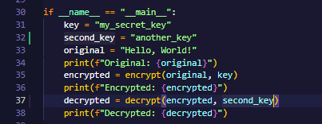
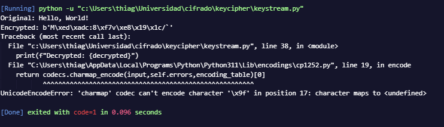
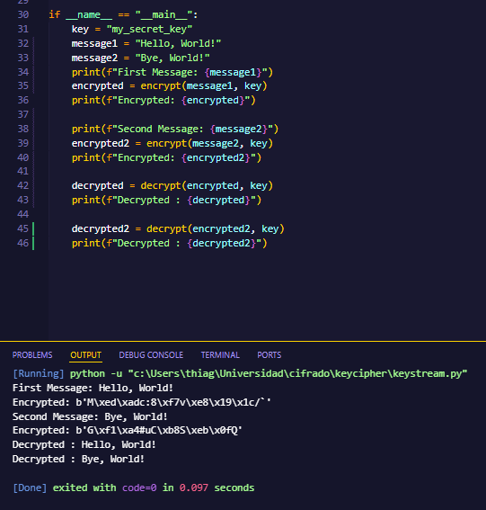
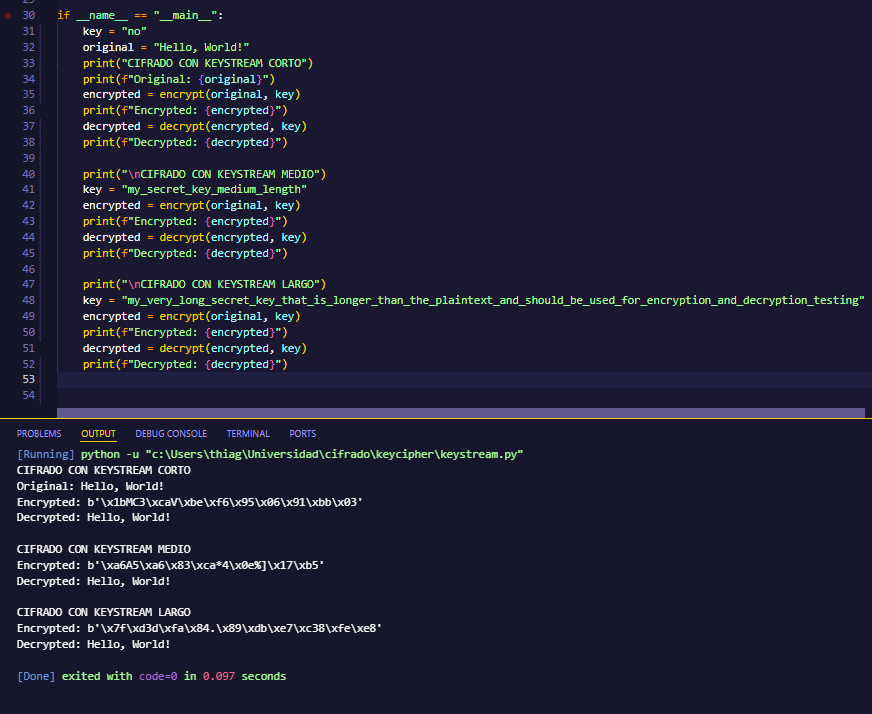
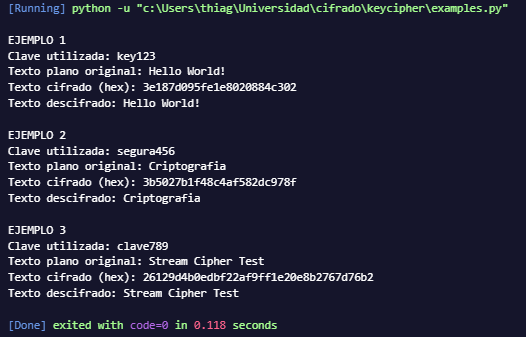

### Sebastian Huertas 22295

# Ejercicio STEAM

## Parte 2: Análisis de Seguridad (20 puntos)

### 2.1 Variación de la Clave (5 puntos)
- ¿Qué sucede cuando cambia la clave utilizada para generar el keystream? Demuestre con un ejemplo concreto.

Cuando se cambia la llave para desencriptar, genera un keystream diferente al que se uso para encriptar, porque el generador depende directamente de la seed. Como el cifrado funciona aplicando XOR, solo se puede revertir correctamente si se uso exactamente la misma secuencia de numeros. Al usarse otra llave, el XOR no recupero el texto original sino bytes aleatorios. Esos bytes no corresponden a caracteres validos, por eso aparece el error de codificacion al intentar imprimirlos

### 2.2 Reutilización del Keystream (5 puntos)
- ¿Qué riesgos de seguridad existen si reutiliza el mismo keystream para cifrar dos mensajes diferentes? Implemente un ejemplo que demuestre esta vulnerabilidad.
- Sugerencia: Cifre dos mensajes con la misma clave y analice qué información puede extraer un atacante que intercepte ambos textos cifrados.

Cuando se reutilizo el mismo keystream para cifrar dos mensajes distintos, se esta creando una vulnerabilidad grave porque en un cifrado tipo stream con XOR, si un atacante obtiene ambos textos cifrados puede hacer XOR entre ellos y eliminar el keystream, quedandose con el XOR de los dos mensajes originales, lo que permite recuperar informacion si conoce o adivina parte de uno de los mensajes. Por ejemplo, si hago C1 = M1 XOR K y C2 = M2 XOR K, entonces C1 XOR C2 = M1 XOR M2, y si el atacante sabe que M1 es "Hello World!", puede hacer (C1 XOR C2) XOR M1 y recuperar M2, demostrando que reutilizar la misma clave compromete completamente la confidencialidad

### 2.3 Longitud del Keystream (5 puntos)
-¿Cómo afecta la longitud del keystream a la seguridad del cifrado? Considere tanto keystreams más cortos como más largos que el mensaje.

La longitud del keystream afecta directamente la seguridad porque si es mas corto que el mensaje y se reutiliza o se repite, empiezan a aparecer patrones que pueden ser explotados por un atacante mediante analisis de XOR entre bloques repetidos. Si el keystream tiene la misma longitud que el mensaje y es verdaderamente aleatorio y no se reutiliza, el cifrado es mucho mas seguro, similar a un one time pad. Si es mas largo no hay problema mientras solo se use la parte necesaria y no se reutilice, pero lo critico no es que sea largo sino que no se repita ni se use la misma secuencia para distintos mensajes

### 2.4 Consideraciones Prácticas (5 puntos)
- ¿Qué consideraciones debe tener al generar un keystream en un entorno de producción real? Mencione al menos 3 aspectos críticos

    * Usar un generador criptograficamente seguro para que el keystream no sea predecible
    * No reutilizar el mismo keystream en diferentes mensajes
    * Proteger y generar las claves con suficiente entropia para evitar filtraciones o ataques de fuerza bruta

## Parte 3: Validación y Pruebas (10 puntos)

### 3.1 Ejemplos de Entrada/Salida
Incluya en su documentación al menos 3 ejemplos que muestren:
- Texto plano original
- Texto cifrado (puede mostrarse en formato hexadecimal o base64)
- Texto descifrado
- Clave utilizada

### 3.2 Pruebas Unitarias
Implemente pruebas que validen:
- El descifrado recupera exactamente el mensaje original
- Diferentes claves producen diferentes textos cifrados
- La misma clave produce el mismo texto cifrado (determinismo)
- El cifrado maneja correctamente mensajes de diferentes longitudes