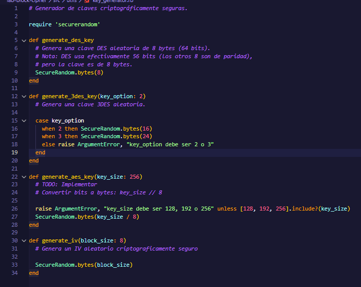
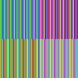
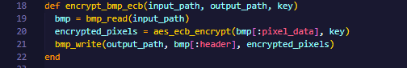
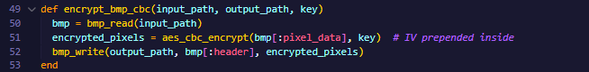
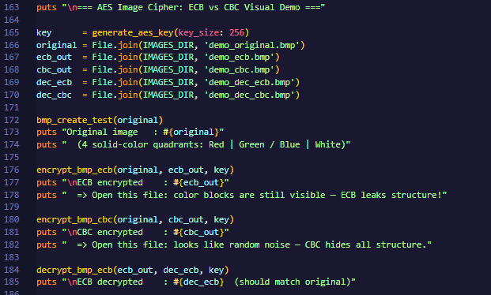
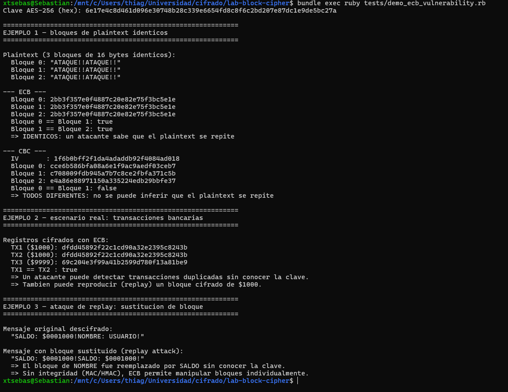
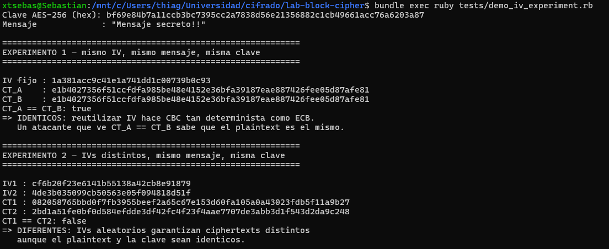
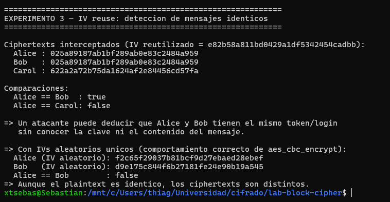
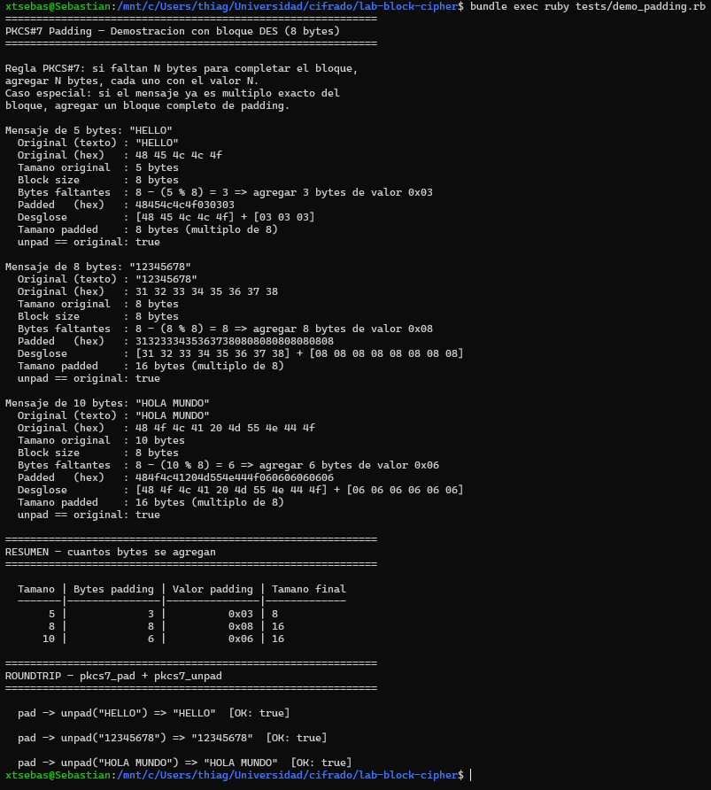

## Sebastian Huertas 22295

# Parte 2: Analisis de Seguridad (25 puntos)

## 2.1 Análisis de Tamaños de Clave. Pregunta: ¿Qué tamaño de clave está usando para DES, 3DES y AES?

### Tamaños de clave utilizados

| Algoritmo | Tamano nominal | Tamano efectivo | Bytes |
|-----------|---------------|-----------------|-------|
| DES       | 64 bits       | 56 bits         | 8     |
| 3DES (op. 2) | 128 bits   | 112 bits*       | 16    |
| 3DES (op. 3) | 192 bits   | 112 bits*       | 24    |
| AES       | 256 bits      | 256 bits        | 32    |

---

### DES — 64 bits nominales / 56 bits efectivos (8 bytes)

De los 64 bits de la clave DES, 8 bits son de paridad (uno por byte) y no participan en el cifrado. La clave funcional es de solo 56 bits.

**Por que DES se considera inseguro hoy?**

DES es inseguro porque su espacio de claves de solo 2^56 (~7.2 x 10^16 combinaciones) es demasiado pequeno para los estandares actuales; en 1998 la maquina EFF "Deep Crack" (USD 250,000) lo rompio en 56 horas evaluando ~9 x 10^10 claves/segundo, y en 2008 COPACOBANA lo logro en ~7 dias con USD 10,000 en FPGAs. Con hardware moderno (FPGA o GPU cluster) que evalua entre 10^12 y 10^13 claves/segundo, el espacio completo se recorre en aproximadamente 1 a 2 horas, haciendo a DES completamente inviable para uso real.

**Calculo de fuerza bruta con hardware moderno**

```
Espacio de claves : 2^56  = 7.2 x 10^16 claves
Velocidad estimada: 10^13 claves/segundo (FPGA/GPU cluster, 2024)

Tiempo maximo     : 7.2 x 10^16 / 10^13 = 7,200 segundos ~ 2 horas
Tiempo promedio   : ~1 hora  (se recorre la mitad del espacio en promedio)
```

---

### 3DES — 128 o 192 bits nominales / 112 bits efectivos

3DES aplica DES tres veces (Encrypt-Decrypt-Encrypt). Con 2 claves de 8 bytes (opcion 2) el espacio nominal es 2^128, pero el ataque meet-in-the-middle lo reduce a 2^112.

**Calculo de fuerza bruta**

```
Espacio efectivo  : 2^112 = 5.19 x 10^33 claves
Velocidad estimada: 10^18 claves/segundo (hipotetico supercomputador futuro)

Tiempo            : 5.19 x 10^33 / 10^18 = 5.19 x 10^15 segundos
                  ~ 164,000,000 anos (164 millones de anos)
```

---

### AES-256 — 256 bits efectivos (32 bytes)

**Calculo de fuerza bruta**

```
Espacio de claves : 2^256 = 1.16 x 10^77 claves
Velocidad estimada: 10^18 claves/segundo (hipotetico supercomputador futuro)

Tiempo            : 1.16 x 10^77 / 10^18 = 1.16 x 10^59 segundos
                  ~ 3.67 x 10^51 anos

Edad del universo : ~1.38 x 10^10 anos

Relacion          : el tiempo de ataque es ~2.66 x 10^41 veces la edad del universo
```

---

### Snippet de referencia — generacion de claves

El codigo que genera las claves para los tres algoritmos esta en un unico archivo:

```
src/utils/key_generator.rb
```

| Funcion            | Descripcion                                      |
|--------------------|--------------------------------------------------|
| `generate_des_key` | Genera 8 bytes aleatorios (clave DES)            |
| `generate_3des_key`| Genera 16 o 24 bytes segun `key_option` (3DES)   |
| `generate_aes_key` | Genera 32 bytes para AES-256 (`key_size: 256`)   |




## 2.2 Comparación de Modos de Operación

### Modos implementados por algoritmo

| Algoritmo | Modo | Archivo |
|-----------|------|---------|
| DES       | ECB  | `src/des_ecb.rb` |
| 3DES      | CBC  | `src/des3_cbc.rb` |
| AES       | ECB y CBC | `src/aes_ecb.rb`, `src/aes_cbc.rb` |

---

### Diferencias fundamentales entre ECB y CBC

**ECB (Electronic Codebook)**
Cada bloque de 16 bytes del plaintext se cifra de forma completamente independiente con la misma clave. Esto significa que dos bloques con el mismo contenido siempre producen exactamente el mismo ciphertext, sin importar su posicion en el mensaje. No requiere IV.

**CBC (Cipher Block Chaining)**
Antes de cifrar cada bloque, se hace XOR con el bloque de ciphertext anterior. El primer bloque se combina con un IV aleatorio. Esto rompe cualquier dependencia entre bloques identicos: aunque dos bloques tengan el mismo plaintext, su ciphertext sera diferente porque el resultado previo es distinto en cada posicion.

| Caracteristica        | ECB                        | CBC                          |
|-----------------------|----------------------------|------------------------------|
| Bloques independientes| Si                         | No (encadenados)             |
| IV requerido          | No                         | Si (aleatorio)               |
| Determinista          | Si (misma clave = mismo CT)| No (IV distinto cada vez)    |
| Revela patrones       | Si                         | No                           |
| Parallelizable        | Si (cifrado y descifrado)  | Solo descifrado              |

---

### Se puede notar la diferencia en una imagen?

Si, y de forma muy evidente. La imagen de prueba tiene cuatro cuadrantes de color solido (rojo, verde, azul, blanco). Cada cuadrante contiene miles de pixeles identicos, lo que genera miles de bloques AES con el mismo contenido.

- **ECB**: bloques identicos → ciphertext identico → los cuadrantes siguen siendo
  visibles como regiones uniformes. La forma y estructura de la imagen original
  se preserva por completo en la imagen cifrada.

- **CBC**: cada bloque se mezcla con el anterior → aunque el plaintext se repita,
  el ciphertext es diferente en cada posicion. La imagen cifrada es indistinguible
  de ruido aleatorio.

### Imagenes de comparacion

| Original | Cifrada con ECB | Cifrada con CBC |
|----------|----------------|-----------------|
|  |  |  |

---

### Codigo exacto para generar las imagenes

El codigo esta repartido en dos archivos. Referencia de lineas:

**`src/image_cipher.rb` — funciones de cifrado de imagen**

| Funcion | Descripcion |
|---------|-------------|
| `encrypt_bmp_ecb` | Lee BMP, cifra pixeles con AES-ECB, escribe resultado |
| `encrypt_bmp_cbc` | Lee BMP, cifra pixeles con AES-CBC (IV incluido), escribe resultado |




**`tests/test_image_cipher.rb` — demo que genera los archivos**




## 2.3 Vulnerabilidad de ECB. Pregunta: ¿Por qué no debemos usar ECB en datos sensibles?

### Bloques identicos producen ciphertext identico

ECB cifra cada bloque de 16 bytes de forma totalmente independiente. Si dos bloques
del plaintext son iguales, sus ciphertexts seran exactamente iguales con la misma
clave. Esto rompe la confidencialidad porque un observador puede detectar patrones
en el ciphertext sin necesidad de conocer la clave.

Mensaje de prueba: `"ATAQUE!!ATAQUE!!"` repetido 3 veces (3 bloques identicos de 16 bytes).

```
Plaintext:
  Bloque 0: "ATAQUE!!ATAQUE!!"
  Bloque 1: "ATAQUE!!ATAQUE!!"   <- identico al bloque 0
  Bloque 2: "ATAQUE!!ATAQUE!!"   <- identico al bloque 0

ECB — ciphertext:
  Bloque 0: a3f8... [16 bytes]
  Bloque 1: a3f8... [16 bytes]   <- IGUAL que bloque 0
  Bloque 2: a3f8... [16 bytes]   <- IGUAL que bloque 0
  => Bloque 0 == Bloque 1 == Bloque 2: true
  => Un atacante sabe que el plaintext se repite, sin descifrar nada.

CBC — ciphertext:
  IV       : 9c2e... [16 bytes aleatorios]
  Bloque 0: d471... [16 bytes]
  Bloque 1: 08ba... [16 bytes]   <- diferente
  Bloque 2: f3c1... [16 bytes]   <- diferente
  => Bloque 0 == Bloque 1: false
  => No se puede inferir ninguna relacion entre bloques.
```



---

### Que informacion puede filtrar ECB en escenarios reales?

**Escenario 1 — transacciones bancarias**

Un sistema cifra registros de 16 bytes por transaccion con ECB. Dos transferencias
de $1000 producen exactamente el mismo bloque cifrado. Un atacante que intercepta
el trafico puede detectar que dos operaciones son identicas sin conocer su contenido,
contar cuantas veces se repite una operacion, y realizar un ataque de replay
reenviando un bloque cifrado de $1000 para duplicar la transaccion, porque el
servidor lo acepta como valido (ECB no tiene integridad ni dependencia de posicion).

**Escenario 2 — cifrado de contrasenas o tokens**

Si una base de datos cifra contrasenas con ECB y la misma clave, dos usuarios con
la misma contrasena tendran el mismo ciphertext. Un atacante con acceso a la BD
puede identificar usuarios con contrasenas identicas sin descifrarlas, y usar
tablas de bloques precomputados de forma similar a rainbow tables.

**Escenario 3 — imagenes y multimedia**

Como demuestra el demo visual (seccion 2.2), los patrones de la imagen original
siguen siendo visibles en la imagen cifrada con ECB. La estructura del contenido
queda expuesta aunque no se pueda reproducir directamente.

---


## 2.4 Vector de Inicialización (IV). Pregunta: ¿Qué es el IV y por qué es necesario en CBC pero no en ECB?

### Que es el IV?

El IV (Vector de Inicializacion) es un bloque de bytes aleatorios (16 bytes para AES) que se usa como entrada adicional al inicio del cifrado. Su unico requisito es que sea unico por cada operacion de cifrado; no necesita ser secreto.

### Por que ECB no necesita IV?

ECB cifra cada bloque de forma independiente: `C_i = Enc_K(P_i)`. No hay estado
entre bloques, no hay nada que "inicializar". La consecuencia directa es que ECB
es completamente determinista: misma clave + mismo plaintext = mismo ciphertext
siempre, lo cual es precisamente su debilidad.

### Por que CBC necesita IV?

En CBC la formula de cifrado es: `C_i = Enc_K(P_i XOR C_{i-1})`.
El primer bloque no tiene bloque anterior, por lo que se usa el IV como sustituto:
`C_0 = Enc_K(P_0 XOR IV)`.

Sin el IV, el primer bloque tambien seria determinista, exponiendo el mismo problema
que ECB. Con un IV aleatorio y unico por mensaje, incluso el primer bloque produce
ciphertext diferente cada vez, rompiendo cualquier patron detectable.

---

### Experimento: mismo IV vs IVs distintos



```
Mensaje   : "Mensaje secreto!!"
Clave     : AES-256 (32 bytes aleatorios)

EXPERIMENTO 1 — mismo IV dos veces:
  IV fijo  : be33... [16 bytes]
  CT_A     : 6f42... [mismo]
  CT_B     : 6f42... [mismo]
  CT_A == CT_B: true
  => IDENTICOS. Reutilizar IV hace CBC tan determinista como ECB.

EXPERIMENTO 2 — IVs distintos:
  IV1      : 9c2e... [16 bytes]
  IV2      : a71f... [16 bytes distintos]
  CT1      : d471...
  CT2      : 08ba... [completamente diferente]
  CT1 == CT2: false
  => DIFERENTES. IVs aleatorios garantizan ciphertexts distintos.
```

---

### Que pasa si un atacante intercepta mensajes con el mismo IV?

Si un sistema reutiliza el mismo IV con la misma clave, el cifrado pierde
no-determinismo. Un atacante que intercepta el trafico puede:

1. **Detectar mensajes identicos.** Si dos ciphertexts son iguales, el atacante
   sabe que los plaintexts son iguales, sin descifrar nada. Esto filtra informacion
   sobre patrones de comunicacion (ej. el mismo token de sesion, el mismo login,
   la misma transaccion).

2. **Ataque de IV fijo conocido (CBC IV reuse).** Si el atacante conoce el plaintext
   de un mensaje anterior (P1, C1, IV), puede verificar hipotesis sobre un nuevo
   mensaje P2 capturado (C2, mismo IV): si C2[bloque0] == C1[bloque0], entonces
   P2[bloque0] == P1[bloque0]. Esto permite confirmar o descartar contenido sin
   descifrar.

3. **TLS BEAST (2011).** Este ataque real explotaba exactamente este problema en
   TLS 1.0: el IV del siguiente registro era el ultimo bloque del registro anterior
   (predecible), lo que permitia un ataque de texto plano elegido para recuperar
   cookies de sesion.

**Ejemplo del experimento 3** (tres sesiones cifradas con el mismo IV):


```
Alice (LOGIN: ADMIN!!!): cc6d2a... <- mismo ciphertext
Bob   (LOGIN: ADMIN!!!): cc6d2a... <- IGUAL que Alice
Carol (LOGIN: GUEST!!!): ae4103... <- diferente

=> El atacante sabe que Alice y Bob tienen el mismo login/token sin conocer la clave ni el contenido.
```
---

## 2.5 Padding. Pregunta: Que es el padding y por que es necesario?

### Que es el padding?

Los cifrados de bloque (DES, AES) operan sobre bloques de tamano fijo: 8 bytes para
DES y 16 bytes para AES. Si el mensaje no es multiplo exacto del tamano de bloque,
el ultimo bloque queda incompleto y el cifrador no puede procesarlo. El padding es
el relleno que se agrega al final del mensaje para completar ese bloque.

---

### Resultados de pkcs7_pad — byte a byte (block_size = 8, DES)



**Mensaje de 5 bytes: `"HELLO"`**

```
Original (hex)   : 48 45 4c 4c 4f
Bytes faltantes  : 8 - (5 % 8) = 3  =>  agregar 3 bytes de valor 0x03
Padded   (hex)   : 48454c4c4f030303
Desglose         : [48 45 4c 4c 4f] + [03 03 03]
Tamano padded    : 8 bytes (multiplo de 8)
unpad == original: true
```

**Mensaje de 8 bytes: `"12345678"` (bloque exacto)**

```
Original (hex)   : 31 32 33 34 35 36 37 38
Bytes faltantes  : 8 - (8 % 8) = 8  =>  agregar 8 bytes de valor 0x08
Padded   (hex)   : 3132333435363738 0808080808080808
Desglose         : [31 32 33 34 35 36 37 38] + [08 08 08 08 08 08 08 08]
Tamano padded    : 16 bytes (multiplo de 8)
unpad == original: true

Nota: el mensaje ya ocupa un bloque completo, asi que se agrega un bloque
entero de padding. Esto garantiza que unpad siempre tenga bytes que quitar.
```

**Mensaje de 10 bytes: `"HOLA MUNDO"`**

```
Original (hex)   : 48 4f 4c 41 20 4d 55 4e 44 4f
Bytes faltantes  : 8 - (10 % 8) = 6  =>  agregar 6 bytes de valor 0x06
Padded   (hex)   : 484f4c41204d554e444f060606060606
Desglose         : [48 4f 4c 41 20 4d 55 4e 44 4f] + [06 06 06 06 06 06]
Tamano padded    : 16 bytes (multiplo de 8)
unpad == original: true
```

**Demostracion de roundtrip: pkcs7_pad + pkcs7_unpad**

```
pad -> unpad("HELLO")      => "HELLO"      [OK: true]
pad -> unpad("12345678")   => "12345678"   [OK: true]
pad -> unpad("HOLA MUNDO") => "HOLA MUNDO" [OK: true]
```

La funcion `pkcs7_unpad` lee el ultimo byte del mensaje padded, lo interpreta como
la cantidad de bytes de padding, y los elimina con `data[0...-pad_len]`. Esto es
siempre inequivoco porque PKCS#7 garantiza que el ultimo byte tenga exactamente
el valor de cuantos bytes de padding se agregaron.

---
